## Hi there 👋 I'm Lê Trung Anh Quốc

**Backend Engineer | Data Engineer**

I focus on building reliable backend systems, scalable data pipelines, and data processing workflows for real-world applications, with hands-on experience in reconciliation, database design, and data integration.

### About Me

* **Currently building:** Backend services, reconciliation systems, ETL/data processing pipelines, and data-driven applications.
* **Focus:** Backend Engineering, Data Engineering, REST APIs, Database Design, Data Pipelines, ETL/ELT, and Reconciliation Logic.
* **Interested in:** Scalable backend architecture, distributed data processing, workflow automation, and applying AI/RAG to data-intensive systems.

---

### 💻 Tech Stack & Tools

  <b>Languages</b> 
  
  
  
  
  

  <b>Backend Engineering</b> 
  
  
  
  
  

  <b>Data Engineering & Databases</b> 
  
  
  
  
  
  

  <b>AI & Data Applications</b> 
  
  
  

  <b>DevOps & Tools</b> 
  
  
  

---

### 📊 GitHub & LeetCode

<table>
  <tr>
    <td width="58%" valign="top">
      
        
      
    </td>
    <td width="4%"></td>
    <td width="38%" valign="top" align="center">
      
    </td>
  </tr>
</table>
 
